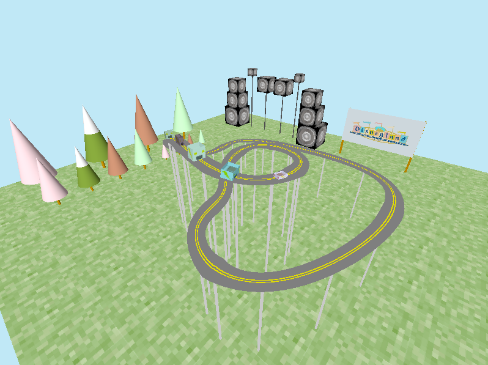

# amusement_park
OpenGL Project to make/improve an amusement park themed environment

#
Starting from a basic implementation of a running environment, I implemented:
* texture mapping
* paramatric instancing
* swept track along the path
* added front cart and last cart first person view

